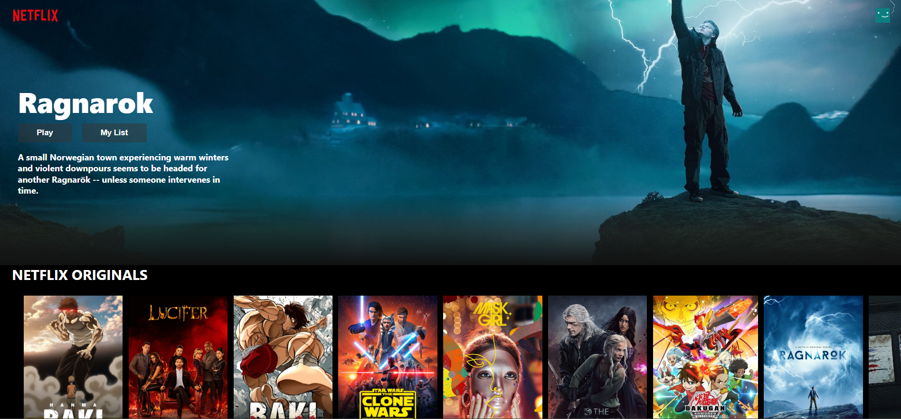

# Netflix Clone ReactJS Project

This project is a Netflix clone built using ReactJS, designed to showcase the main features of the Netflix platform. It includes a sign-in page and a main home page where users can play trailers of Netflix original movies and shows.
Demo - [Netflix-clone](https://kn-netflix-clone.netlify.app/)

## Table of Contents

- [Features](#features)
- [Screenshots](#screenshots)
- [Usage](#usage)

## Features

- **Sign-In Page:** Users can sign in by clicking on 'Watch Free For 30 Days'.

- **Main Home Page:** After signing in, users are directed to the main home page which displays a collection of Netflix original movies and TV shows.

- **Trailer Playback:** Each movie or TV show item on 'Netflix Originals' has a clickable element that opens a modal window. This modal displays the trailer of the selected title fetched from a source like YouTube.

- **Responsive Design:** The user interface is designed to be responsive, ensuring a seamless experience across various devices and screen sizes.

## Screenshots

_Users can sign in with their Netflix account._

_The main home page displays a grid of Netflix original movies and TV shows._

_When a user clicks on a title, a modal pops up displaying the trailer of the selected title._

## Usage

- Sign in on Netflix by clicking on 'Watch Free For 30 Days'.
- Browse through the collection of Netflix original movies and TV shows on the main home page.
- Click on a title to open a modal displaying the trailer of the selected title.
- Enjoy the seamless trailer playback experience.
